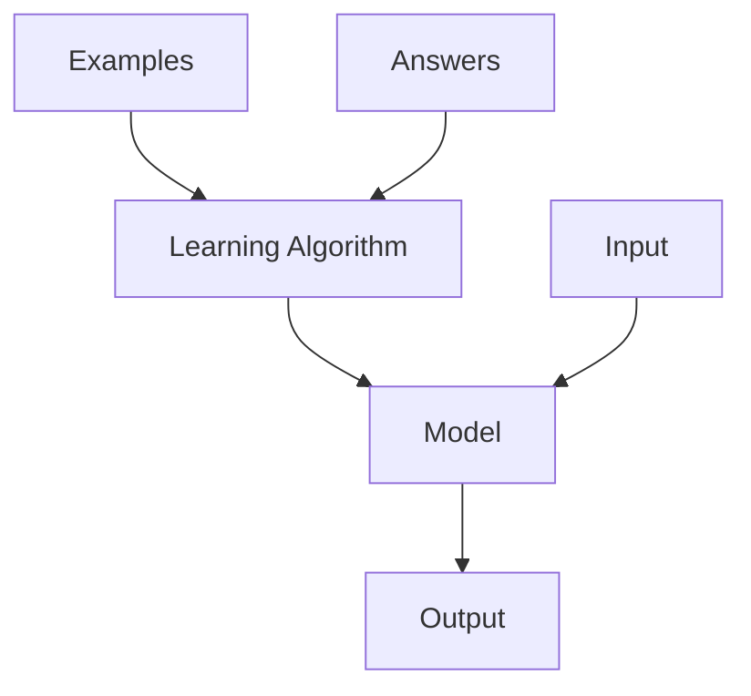

# Machine Learning

```mermaid
graph TD
    ML1[Examples]
    ML2[Answers]
    ML1 --> ML3[Learning Algorithm]
    ML2 --> ML3
    ML3 --> ML4[Model]
    NewInput[Input] --> ML4
    ML4 --> ML5[Output]
```